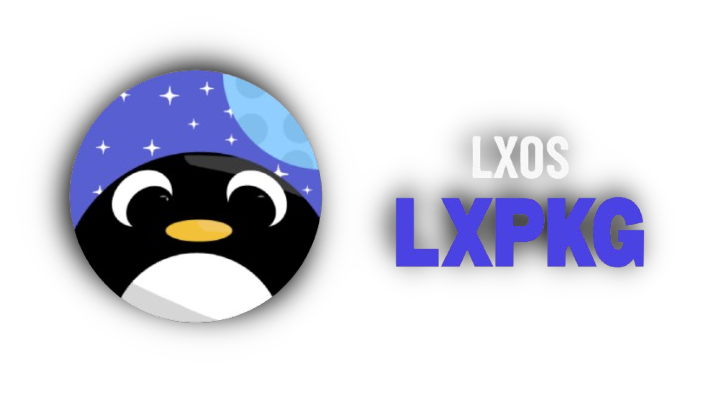

##### ⚠️ (ALPHA STAGE) OUR DEVELOPER TEAM IS DOING ITS BEST TO ALWAYS IMPROVE THE PROJECT 👨‍💻

# LXPKG - LXOS LINUX DISTRIBUTION

A simple, POSIX-compliant, source-based package manager in C++.

## Features
- Install, remove, list, and search packages.
- Supports `make`, `cmake`, `meson`, `ninja`, `configure`, and `python` build systems.
- Dependency resolution with user confirmation (Y/n).
- Detailed, color-coded output with bold and italic formatting.
- Automatic fallback system for faulty build files.
- Maintains a database of installed packages with versions.
- Reads package metadata from `build`, `sources`, `version`, and `depends` files.
- Searches packages in `core`, `extra`, and `wayland` subdirectories.
- Removes packages from multiple common paths (`/usr/local/bin`, `/usr/bin`, `/opt`, etc.).
- Supports `.tar.gz`, `.tar.xz`, and `.tar.bz2` source tarballs.
- Updates desktop database and icon cache after installation.
